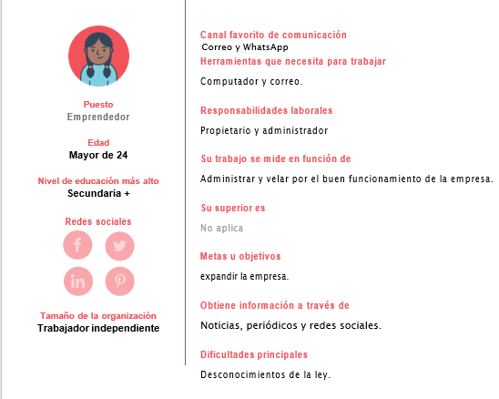
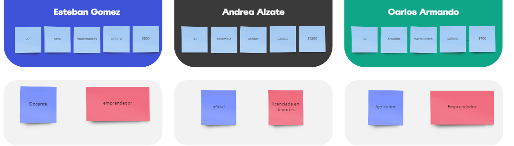
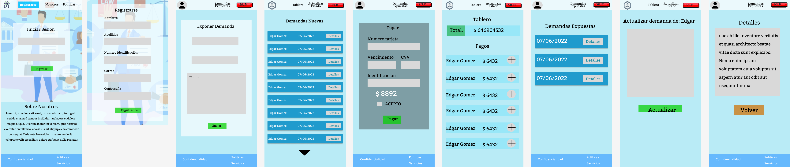
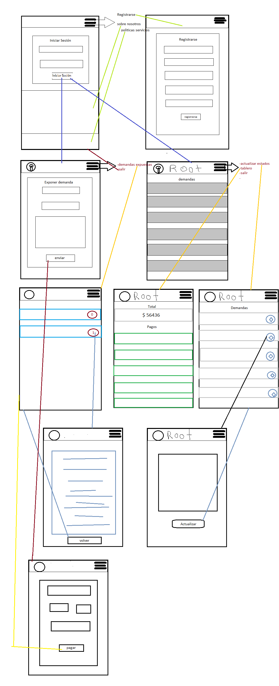

#### Este ejercicio consiste en el desarrollo de el buyer, publico objetivo, UI, UX y requerimientos en base al caso Abogabot.

# Abogabot

## Caso Abogabot

Es un despacho de abogados que quiere automatizar las demandas de sus clientes, esto lo harán a traves de una página web llenando un formulario.

## Requerimientos

`cuenta de usuario`: se debe contar con un inicio de sesión para los clientes y el administrador permitiendo que estos puedan realizar sus operaciones. si no tiene una cuenta se le permite al cliente crearla para que opere. 

`Cliente`: el cliente debe tener acceso a un formulario para exponer su demanda y el pago del seguimiento de esta, además, le deben llegar correos de actualización del estado de seguimiento.

`Administrador`: el administrador debe ver los pagos realizados en un tablero y realizar las actualizaciones del proceso de la demanda y agregar comentarios.

`Detalles`: La página debe de ser responsive para poderla ver desde el celular. La preferncia de colores del cliente es azul marino y blanco, pero acepta propuestas.

# Buyer

  
# Publico Objetivo

# UI Interfaz de Usuario

# UX Experiencia de Usuario

